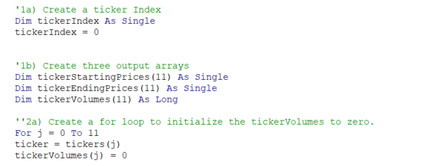
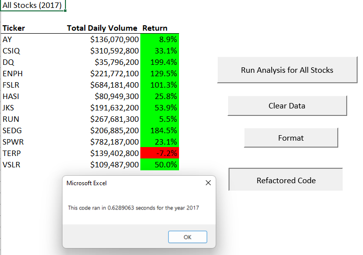
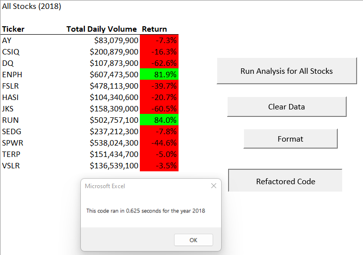

# Refactoring Code VBA

## Overview of Project

### Purpose
This project is to provide a VBA code for Steve, who wants to help his parents to diversify their funds by analyzing a handful of green energy stocks. For doing that Steve has shared an excel file that contains the stock data but what he needs is to have a macro built on VBA that helps him to automate this task to analyze the stock's performance through different years.

Technically what we're doing in this project is to improve/refactored the starter code that allows Steve to have faster results because maybe at some point he'll be analyzing bigger data sets that will demand a more efficient code.

### Results
Refactoring the initial code required to create a new variable to loop through all the tickers and set it to zero before iterating over all the rows, this variable was "tickerIndex" which would increase after collecting the outputs from the different arrays.

The initial code that we developed ran the analysis in .82 seconds for 2017 and in .73 for 2018 so after refactoring the code we could have an improvement as we see in the next screenshots:

Code performance por 2017

Code performance por 2018

## Summary

### What are the advantages or disadvantages of refactoring code?
I think the advantages of refactoring are: 
1. It gives you an idea of the code structure
2. It will give you a closer look of what you can improve

Talking about disadvantages:
1. It takes time to understand what the original developer tried to map with variables and loops structures. 
2. Errors in the original code could be "invisible" util you actually run the refactored code.

### How do these pros and cons apply to refactoring the original VBA script?
The main advantage for this project was that we had the structure and comments that helped to finally accomplish the goal of making this code run faster.
